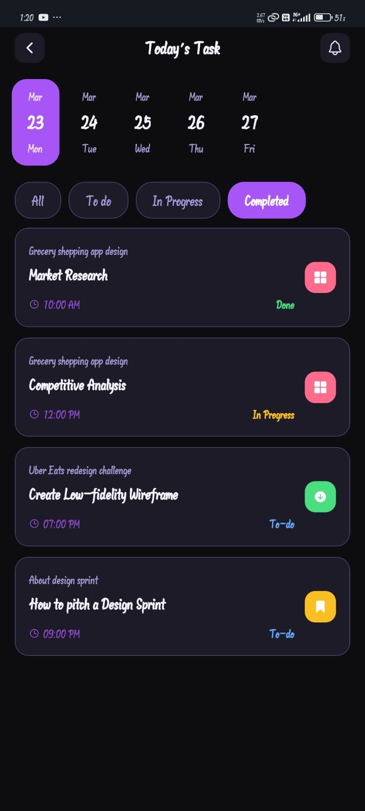
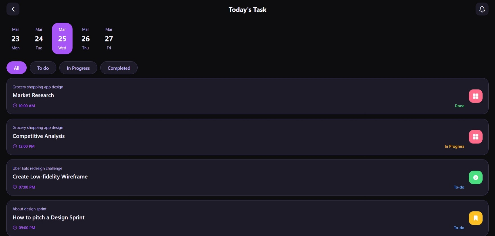

# 🎨 UI/UX Refresh — List App

This project is a **UI/UX skill refresh exercise** built with Expo and React Native.  
It focuses on front‑end design and layout for a Todo List app, showcasing how tasks, filters, and themes could look on mobile and web.

---
## 📱 UI / UX Preview

### Mobile View


### Laptop / Web View



---

## 📦 Prerequisites

Make sure you have the following installed:

- [Node.js](https://nodejs.org/)  
- Code editor (e.g., VS Code)  
- Git Bash (or any terminal)  
- **Expo Go** app on your mobile device (Android/iOS)

---

## 🚀 Getting Started

### 1. Create a new Expo project

```bash
npx create-expo-app@latest
```

or specify a project name:

```bash
npx create-expo-app my-todo-list
```

---

### 2. Navigate into the project

```bash
cd TodoList
```

---

### 3. Run the project

```bash
npm run android   # Run on Android emulator/device
npm run ios       # Run on iOS (requires macOS)
npm run web       # Run in browser
```

💡 For iOS development without a Mac, use the **Expo Go** app.

---

### 4. Install a stable Expo version

To avoid compatibility issues, install the stable Expo version (check [Expo docs](https://docs.expo.dev/)):

```bash
npm install expo@54
```

Then install required Expo dependencies:

```bash
npx expo install expo-constants expo-device expo-font expo-glass-effect expo-image expo-linking expo-router expo-splash-screen expo-status-bar expo-symbols expo-system-ui expo-web-browser
```

---

### 5. Reset the project (optional)

```bash
bun run reset-project
```

Press **n** and hit **Enter** when prompted.

---

### 6. Install React dependencies (compatible with Expo 54)

```bash
npx expo install react react-dom react-native react-native-gesture-handler react-native-reanimated react-native-screens react-native-worklets @types/react
```

---

## ▶️ Running the App

Start the project:

```bash
npx expo start
```

Scan the QR code using the **Expo Go** app on your mobile device to view the UI/UX demo.

---

## 📖 Notes

- This project currently focuses on **UI/UX design only** (front‑end showcase).
- Functionality (adding, editing, deleting todos) can be implemented later.
- Always use the stable Expo version to avoid dependency issues.
- Clear cache if you face errors:
  ```bash
  expo start -c
  ```

---

## 📱 Platforms Supported

- Android
- iOS (via Expo Go or macOS build)
- Web

---

## 📖 License

This project is for learning and design showcase purposes.


